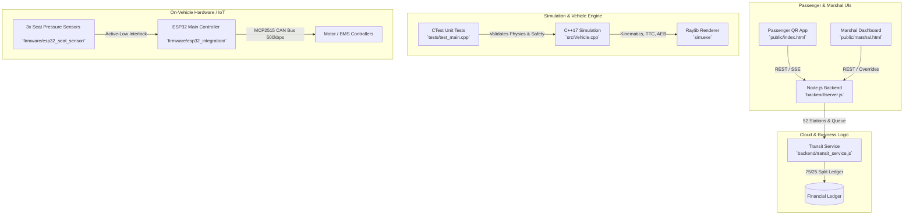

# Easy Drive 🚗⚡

> **Autonomous Campus Transport Fleet & B2G Fleet Management System**
> *Designed for University Environments (Target Deployment: ADUSTW Wudil, Nigeria)*

[](https://en.cppreference.com/w/cpp/17)
[](https://www.raylib.com/)
[](https://nodejs.org/)
[](https://www.espressif.com/)
[](#)

---

## 🎯 Project Overview

**Easy Drive** is a rugged, cost-effective autonomous campus transport fleet engineered specifically for high-utilization university environments in developing regions. Operating on a **Business-to-Government (B2G)** model, the university owns and operates the fleet to provide reliable student transit while generating internal fare revenue.

The system integrates a **C++17 physics-based simulation engine**, **ESP32 microcontroller firmware** (CAN bus / seat sensors), and a **Node.js cloud backend** with real-time passenger booking and financial splitting.

---

## 🏗️ System Architecture



---

## ⚙️ Key Technical Highlights

### 1. Physics & Vehicle Simulation (`vehicle-sim`)
- **Rigid-Body Kinematics & Weight Transfer:** Realistic longitudinal and lateral load transfer, tire friction ellipse limits, and aerodynamic drag calculations.
- **Autonomous Safety Systems:** 
  - **Adaptive Cruise Control (ACC):** Maintains safe headways and dynamic speed matching against leading vehicles.
  - **Autonomous Emergency Braking (AEB) & TTC:** Real-time Time-To-Collision (TTC) calculations with moving targets and dynamic braking telemetry HUD.
- **Robust Test Suite:** Comprehensive unit testing via CTest (`sim_tests.exe`) covering kinematics, collision avoidance, and transit state transitions.

### 2. Operational State Machine & QR Booking
- **Anywhere QR Booking (#1 to #52):** Passengers scan station-specific QR codes to broadcast pickup requests, compute dynamic ETAs, and process fares.
- **Safety Interlock State Machine:**
  - `WAITING_AT_STATION`: Vehicle propulsion remains locked via CAN bus until all **3 seat pressure sensors** register occupancy (or overridden by a transit marshal).
  - `TRIP_IN_PROGRESS`: Intermediate seat sensor drops are safely ignored during transit until the destination station is reached.

### 3. Financial & Revenue Split Model
- **Automated 25% / 75% Split:** Every transaction automatically allocates **25%** to the developer's technical maintenance retainer and **75%** to the university treasury.
- **Hybrid Payment Ledger:** Supports digital payment gateway subaccount split payloads alongside cash proxy collections managed by station marshals.

### 4. IoT Firmware (`firmware/`)
- **ESP32 & CAN Bus Integration:** High-speed 500kbps CAN communication via MCP2515 for motor controllers and Battery Management Systems (BMS).
- **Hardware-in-the-Loop (HIL) Safety:** Ensures physical seating verification before allowing remote cloud dispatch commands to engage vehicle propulsion.

---

## 📂 Repository Structure

```tree
vehicle-sim/
├── backend/            # Node.js REST API, transit service, and integration tests
├── build/              # CMake build output directory & executables
├── firmware/           # ESP32 C++ firmware (CAN bus, seat sensors, main controller)
├── include/            # C++ headers (ACC, behavior tree, collision avoidance, Vehicle)
├── public/             # Frontend UIs (Passenger Booking App & Marshal Dashboard)
├── src/                # C++ simulation source files (main.cpp, Vehicle.cpp)
├── tests/              # CTest automated test suite (test_main.cpp)
└── instruction.md      # Project engineering mandates and deployment specs
```

---

## 🚀 Quickstart & Developer Guide

### Prerequisites
- **CMake** (v3.20+) & **C++17 Compiler** (MSVC / GCC / Clang)
- **Node.js** (v16+) & **npm**

### 1. Build & Run the C++ Simulation
```bash
# Configure and build with CMake
cmake -B build
cmake --build build --config Release

# Run the simulation
./build/Release/sim.exe

# Run the automated unit test suite (CTest)
cd build
ctest --output-on-failure
```

### 2. Run the Cloud Backend & Web UIs
```bash
cd backend
npm install
npm start
```
*Access the Passenger Booking App at `http://localhost:3000` and the Marshal Dashboard at `http://localhost:3000/marshal.html`.*

---

## 📜 License
Proprietary & Confidential. Developed for ADUSTW Wudil deployment. All rights reserved.
